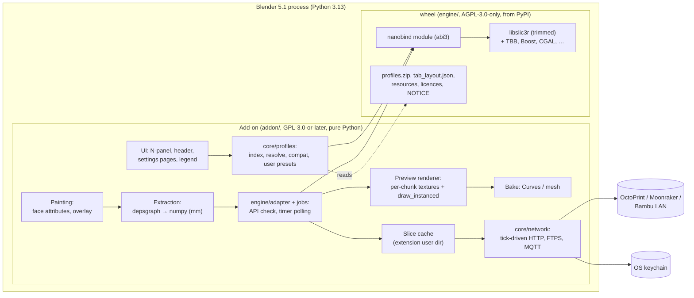

# Design 01: Architecture overview

Status: draft for review, 2026-10-09. This is the entry point to the design.

| Doc | Covers |
|---|---|
| [02-native-engine.md](02-native-engine.md) | The `<engine>` engine: OrcaSlicer's libslic3r trimmed, bound with nanobind, built and packaged |
| [03-blender-addon.md](03-blender-addon.md) | The add-on: UI, profiles, painting, orchestration, GPU preview, networking, packaging |
| [04-engine-api.md](04-engine-api.md) | **The authoritative interface** between the two |
| [../publishing/compliance.md](../publishing/compliance.md) | **All** licensing, store-policy, naming and Bambu-access rules |
| [../implementation/plan.md](../implementation/plan.md) | Spikes, milestones, PR stacks, risks, tests, release checklist |

Placeholders: `<Product>` is the product name and `<engine>` the engine's PyPI and import name; neither is chosen yet (§9).

---

## 1. Purpose and scope

An FDM 3D-printing slicer that runs inside Blender 5.1 as an extension. You model in Blender, pick a printer, filaments and a process profile, slice with the OrcaSlicer engine in-process, inspect the toolpaths in the viewport like a dedicated slicer, then export G-code or send it to a printer.

**v1 scope (fixed):**
- Slice, preview and export on macOS (arm64), Windows (x64) and Linux (x64).
- Multi-object plates, per-object settings, multi-material (per-object filament plus painted regions). Multi-nozzle (H2D-style) profiles compose and slice.
- Painted support enforcers/blockers and seams.
- A GPU-overlay preview with layer and move scrubbing, view modes and a legend with time and filament per feature, plus **bake to Curves or mesh** for rendering.
- Send to OctoPrint, Moonraker/Klipper and Bambu Lab printers in LAN Developer Mode.
- Vendor presets from Orca's library, plus user presets.
- Public and licence-compliant. The self-hosted extension repository is the guaranteed channel; extensions.blender.org is uncertain.

**Not in v1:** multiple plates, modifier and negative volumes, instancing optimisation, SLA, CAD/STEP import, texture painting, incremental re-slicing, cloud printing. 04 §12 lists the reserved engine API. The plan's §8 proposes a further cut line, awaiting a decision.

---

## 2. Components



| Component | Lives in | Responsibility | Design |
|---|---|---|---|
| Engine binding | `engine/src/binding` | The 04 API: config composition, jobs, results as numpy | 02 §4–§6 |
| Trimmed libslic3r and ported glue | `engine/third_party/OrcaSlicer`, `engine/patches`, `engine/src/glue` | Slicing, supports, G-code, GCodeProcessor, `.gcode.3mf` | 02 §2–§3, §5.9 |
| Profiles data | engine wheel (`profiles_archive()`) | Orca's preset JSON, one zip | 02 §7.1 |
| Profile subsystem | `addon/<product>/core/profiles` | Index, `inherits`/`include` resolution, compatibility, user presets | 03 §3 |
| Settings UI | `addon/<product>/blender` | PropertyGroup from `config_schema()`, pages from `tab_layout()`, hand-written rules | 03 §2.3–§2.4 |
| Extraction and paint | `blender/extract.py`, `paint/` | Evaluated meshes to bed-frame arrays; face attributes to paint arrays | 03 §4–§5 |
| Orchestration | `<product>/engine` | Start, poll from timers, cancel, typed errors, staleness, cache | 03 §6 |
| Preview | `blender/preview` | Per-chunk data textures, uniform scrubbing, legend, bake | 03 §7 |
| Export and send | `core/network`, `gcode_export.py` | G-code copy, `.gcode.3mf` via the engine, OctoPrint/Moonraker/Bambu LAN | 03 §8 |
| Fake engine | `addon/tests/fake_engine` | Full 04 API in pure Python for development and CI | 03 §9.2, 04 §11 |

**Threading model.** The add-on uses no Python threads. The engine validates and slices on its own native thread plus TBB workers that never touch the CPython API; the add-on polls from `bpy.app.timers`. Network I/O is non-blocking sockets advanced by timer ticks (04 §9, 03 §6.1, §8.6).

---

## 3. Data flow

```mermaid
sequenceDiagram
  autonumber
  participant U as User
  participant A as Add-on (main thread)
  participant E as <engine>
  participant T as Engine thread + TBB
  U->>A: choose printer, filaments, process
  A->>A: resolve presets (inherits, include) from profiles_archive()
  A->>E: compose_config(printer, process, filaments, project)
  A->>E: normalize_config(flat) → config, errors
  U->>A: Slice
  A->>A: render thumbnails, extract meshes + paint (numpy, mm, bed frame)
  A->>E: SliceJob(); set_config; add_object × N; set_thumbnails
  A->>E: start() (returns at once)
  E->>T: spawn: validate, then slice
  loop every 0.1 s (bpy.app.timers)
    A->>E: poll() → state, %, message
  end
  T-->>E: done (moves SoA, layers, stats, G-code file) or ValidationError
  A->>E: result()
  A->>A: write_gcode → cache; build preview chunks over timer ticks
  A->>U: Preview: scrub layers, legend
  U->>A: Export / Send
  A->>E: write_gcode / write_gcode_3mf / output_filename
  A->>A: tick-driven upload (OctoPrint, Moonraker, Bambu FTPS + MQTT)
```

Details: profiles 03 §3; config 04 §6; geometry 03 §4 and 04 §2.3–§2.4; jobs and errors 04 §4, §7–§8; results 04 §5; preview 03 §7; cache 03 §6.4; export and send 03 §8.

---

## 4. Licensing boundary

`addon/` is **GPL-3.0-or-later**; `engine/` is **AGPL-3.0-only** (derived from OrcaSlicer); the profile JSON ships inside the engine wheel; docs follow the repo-root GPL-3.0 licence. Each directory carries its own `LICENSE`. Add-on code is written from spec and tests, never translated from Orca. The full treatment (link set, corresponding source, notices, store policy, Bambu rules) is in [compliance.md](../publishing/compliance.md).

---

## 5. Distribution channels

| Channel | What | Status |
|---|---|---|
| **PyPI** | `<engine>` wheels `cp312-abi3` for `macosx_11_0_arm64`, `win_amd64`, `manylinux_2_28_x86_64`. **No sdist** | Required: the store accepts only wheels bundled unmodified from PyPI |
| **GitHub Releases** | `engine-vX.Y.Z`: corresponding-source tarball, deps tarballs, debug symbols. `addon-vX.Y.Z`: the three extension zips | Always; this is where the zips are hosted |
| **Self-hosted extension repository** | GitHub Pages serving only `index.json` and HTML, pointing at the Release-asset zips. Users add the URL once and get updates through Blender | **Guaranteed channel** |
| **extensions.blender.org** | The same zips with the store manifest variant | Only with moderator consent (compliance.md §8) |

One pipeline feeds all channels: fetch the pinned wheels from PyPI and verify hashes, `extension build --split-platforms`, validate, attach the zips to a Release, regenerate the Pages index. At most 150 MB per zip, 65 MB target (03 §10).

---

## 6. Recommendation: one monorepo

**A single public repo with `engine/` and `addon/` side by side.** The engine is built and published to PyPI from its subdirectory under its own tag namespace. The repository is renamed before release (no "Blender" in the name).

| Criterion | Monorepo | Separate engine repo |
|---|---|---|
| **AGPL corresponding source** | Clear if the boundary is a directory: `engine/LICENSE`, SPDX headers, a per-release source tarball | Slightly simpler to explain |
| **API changes** | **One PR stack** changes 04, stub, contract tests, fake, binding and adapter together | Two coordinated PR sets with a wheel in between |
| **CI** | Path filters: engine jobs only on `engine/**`; add-on jobs run against the fake | Cross-repo artifact plumbing for contract tests |
| **PyPI trusted publishing** | Works per workflow file (`release-engine.yml` on `engine-v*`, `package-dir=engine`) | Works |
| **Engine reuse** | From PyPI; can be split later with `git filter-repo` | Slightly more discoverable |

Deciding factors: atomic API changes and one place for docs. AGPL clarity comes from a hard directory boundary that CI enforces: every file we write under `engine/` carries `AGPL-3.0-only` and under `addon/` `GPL-3.0-or-later` (the check excludes the Orca submodule, profile JSON and patch files), and the add-on build excludes everything outside `addon/<product>/`.

---

## 7. Repository layout

```
<repo>/                          # renamed before release
├── README.md  LICENSE (GPL-3.0)  CONTRIBUTING.md (DCO, per-directory licences, provenance)
├── docs/
│   ├── design/                  # 01–04
│   ├── implementation/plan.md
│   └── publishing/              # compliance.md, moderator query, listing text, release runbook
├── engine/                      # AGPL-3.0-only  →  PyPI "<engine>"
│   ├── LICENSE                  # AGPL-3.0 text
│   ├── pyproject.toml           # scikit-build-core + nanobind, License-Expression AGPL-3.0-only
│   ├── CMakeLists.txt  cmake/
│   ├── third_party/OrcaSlicer/  # submodule, pinned to a release tag
│   ├── patches/orca/            # numbered, single-purpose patch series
│   ├── deps/                    # trimmed superbuild driver
│   ├── src/binding/  src/stubs/  src/glue/
│   ├── python/<engine>/         # __init__.pyi (generated from 04 §3)
│   ├── tools/                   # gen_tab_layout.py, tab_layout_overrides.json, gen_third_party.py, export_fixtures.py, make_source_tarball.py
│   └── tests/                   # Catch2 subset, pytest, golden corpus, fixtures/exported/
├── addon/                       # GPL-3.0-or-later  →  extension zips
│   ├── LICENSE                  # GPL-3.0 text
│   ├── <product>/               # extension root
│   ├── tests/                   # unit/, blender/, gui/, contract/, fake_engine/
│   └── tools/                   # fetch_wheels.py, build_all.py, make_repo.py
└── .github/workflows/
    ├── engine-ci.yml            # engine/**: deps cache, wheel, Blender load test, contract vs real
    ├── engine-golden.yml        # weekly + on rebase: official Orca binary at the pinned tag vs ours
    ├── addon-ci.yml             # addon/**: pytest ×3, headless Blender, contract vs fake, extension validate
    ├── compliance.yml           # SPDX boundary, licence manifest, asset scan
    ├── release-engine.yml       # engine-v*: cibuildwheel → PyPI + source tarball + mirror
    └── release-addon.yml        # addon-v*: fetch wheels → extension build → Release assets + Pages index
```

The `gh-pages` branch holds only the generated index and HTML. Spike code from Phase 0 never lands on `main`.

---

## 8. Key decisions

| # | Decision | Where |
|---|---|---|
| D1 | Engine is OrcaSlicer's libslic3r in-process as a nanobind `cp312-abi3` module | 02 §0, §4.1 |
| D2 | Orca as a submodule pinned to a release tag plus a small public patch series; our own CMake root | 02 §2–§3 |
| D3 | Deps from Orca's recipes, trimmed, static with hidden visibility (Windows GMP/MPFR decided in Phase 0); OpenSSL, OCCT, OpenCV, mcut and the GUI stack removed | 02 §3 |
| D4 | Pollable native job with a `validating` state; no Python threads; one job per process | 04 §4, §8, §9 |
| D5 | Units mm/s/°C; bed frame = world × scale; 1-based input extruders; 0-based output filament and nozzle; typed errors; `(major, minor)` API version | 04 §2, §5.2, §7, §10 |
| D6 | Python resolves presets; the engine composes, normalises and validates with Orca's code | 03 §3.2, 04 §6 |
| D7 | Profile JSON ships in the engine wheel as one zip; no downloads, no updater | 02 §7.1, 03 §3.1 |
| D8 | Settings UI from `config_schema()` and `tab_layout()`; show/enable rules are a hand-written GPL table | 03 §2.3–§2.4 |
| D9 | Paint stored as INT (32-bit) face attributes; edit-mode assign, optional brush | 03 §5 |
| D10 | Preview by vertex pulling from per-chunk data textures, one `draw_instanced` per chunk; bake to Curves or mesh | 03 §7 |
| D11 | Thumbnails rendered by the add-on, embedded by the engine; `.gcode.3mf` by Orca's writer plus ported glue | 04 §4.1, 02 §5.9 |
| D12 | Networking stdlib-only, tick-driven; Bambu via LAN Developer Mode only, with an explicit do-not list | 03 §8 |
| D13 | One pure-Python fake engine, conformance-tested with the same contract suite as the real wheel | 04 §11 |
| D14 | Add-on GPL-3.0-or-later, engine AGPL-3.0-only; source tarball per engine release, mirrored | compliance.md |
| D15 | Distribution: PyPI wheels, Release-asset zips, self-hosted repo (guaranteed), store (if consented) | §5 |
| D16 | Monorepo with `engine/` and `addon/` | §6 |
| D17 | Platforms: macos-arm64 (11.2+), windows-x64, linux-x64 | 02 §3.4, §7.1 |

---

## 9. Open questions for you

1. **Names.** Product, engine (PyPI and import) and repository names. None may contain "Blender", "Orca" or vendor marks ("<Product>, an FDM slicer for Blender" is fine as a tagline). `slicer-core` and `stratum` are already taken on PyPI. Product candidates: **Stratum** (PyPI clash for the engine only), **Layerwright**, **Plyform**, **Extrudia**, **Toolpath Bench**, **Filamentum**. Each needs a trademark search and store and PyPI checks; the engine name must be registered on PyPI before M7's TestPyPI layer.
2. **Approve the monorepo** (§6).
3. **Moderator query (v2).** Send in Phase 0 (compliance.md §8). The answer is off the critical path.
4. **Orca pin.** *Decided:* OrcaSlicer **v2.4.2** (latest stable, 2026-07-07).
5. **Test hardware.** At least one of X1C/P1S/A1, plus one OctoPrint and one Klipper machine; an H2D if available (H2D send is in v1).
6. **Signing budget.** Apple Developer ID ($99/year) is optional; Windows signing is not planned.
7. **Maintainer identity** for the manifest, PyPI ownership and the GitHub org.
8. **v1 scope.** *Decided:* no cut line; everything ships in v1 (plan §8).
