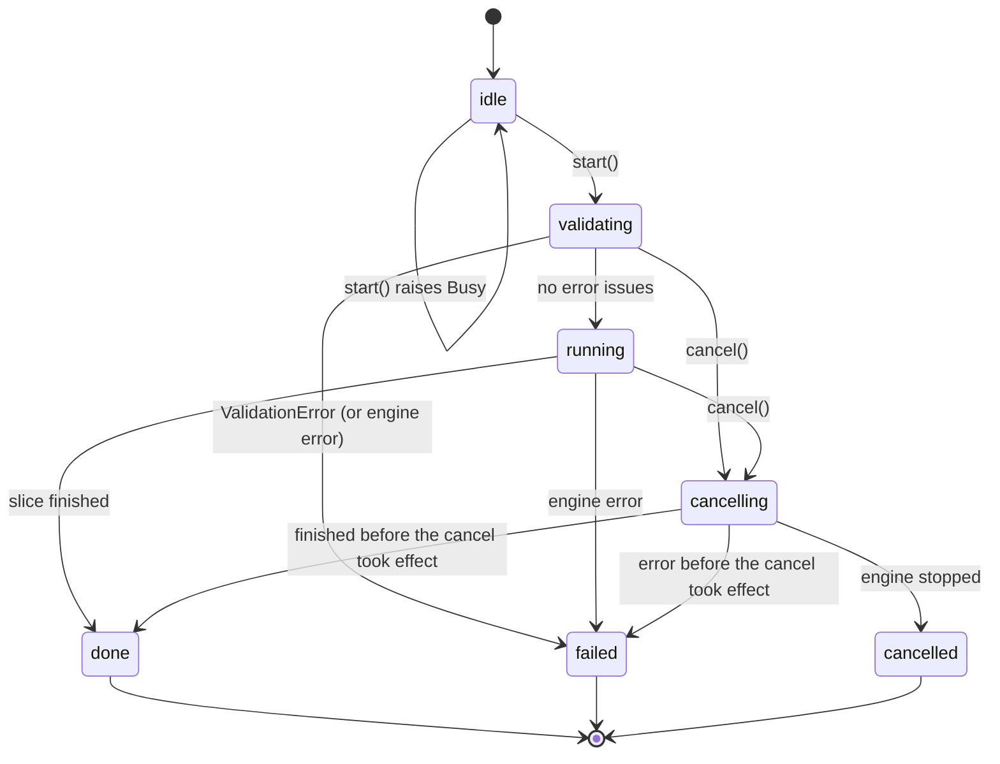

# Design 04: Engine API (`<engine>` API 1.0)

Status: **authoritative**, 2026-10-09. This document is the single source of truth for the interface between the add-on (`addon/`, GPL-3.0-or-later) and the engine (`engine/`, AGPL-3.0-only). Where [02-native-engine.md](02-native-engine.md) or [03-blender-addon.md](03-blender-addon.md) disagree with it, this document wins and the other one is the bug.

---

## 1. Scope, tags and change process

- Changing anything here follows §10–§11: the PR stack that changes the API updates this file, the type stub, the contract tests, the fake engine and the engine together.
- Tags: **[V]** verified in the Orca source (2.5.0-dev tip; re-verified at the pinned release tag in M1-B) or in Blender 5.1.2. **[M2]**, **[M5]**, **[M7]** mean "to be pinned by a test in that milestone" of [the plan](../implementation/plan.md); the contract states the intended behaviour and the test pins it.
- How the engine and add-on designs were reconciled into this spec is recorded in [Appendix A](#appendix-a-reconciliation-decisions).

## 2. Conventions

### 2.1 Names
- PyPI distribution `<engine>`, import name `<engine>`, written `sc` in this document (`import <engine> as sc`). The name is not chosen yet: `slicer-core` and `stratum` are taken on PyPI (01 §9).
- Everything not listed here is private. Names starting with `_` (for example `<engine>._testing`) may change in any release.

### 2.2 Units

| Quantity | Unit | Notes |
|---|---|---|
| Length, position, width, height | mm | float32 on arrays, Python `float` elsewhere |
| Angle in API results | radians | `Placement.rotation_z`. Angles inside config values stay in Orca's units (degrees) |
| Time | s | durations, never cumulative |
| Speed, feedrate | mm/s | |
| Volume | mm³ (`mm3_per_mm` is mm³/mm); `cm3` in stats | |
| Filament length | mm in `moves`; m or mm in stats as named | |
| Mass | g | |
| Temperature | °C | |
| Fan | % (0–100) | |
| Acceleration | mm/s² | |
| Progress | percent, 0.0–100.0 | |

### 2.3 Coordinate frame
- **Bed frame**: right-handed, Z up, mm, origin = the G-code origin, Z = 0 on the bed surface. Orca's `printable_area` and `bed_exclude_area` are in this frame (e.g. `0x0,256x0,256x256,0x256`; deltas are centred on 0).
- All vertex inputs and position outputs are in the bed frame. The add-on maps Blender world space to it by scaling only: `bed = world × scale_length × 1000` (03 §1.4).
- v1 has one plate with its origin at (0, 0). Positions in `moves` are the coordinates written to the G-code, so a non-zero `z_offset` shifts `moves.position[:,2]` [M5].

### 2.4 Mesh inputs

| Argument | dtype | shape | Rules |
|---|---|---|---|
| `vertices` | float32 | (N, 3) | C-contiguous, bed frame, mm |
| `triangles` | int32 | (M, 3) | C-contiguous, counter-clockwise seen from outside. The add-on flips winding for negative-determinant transforms |
| `face_extruder` | uint8 | (M,) | 0 = the object's filament; 1..32 = filament slot |
| `face_support` | uint8 | (M,) | 0 none, 1 enforce, 2 block |
| `face_seam` | uint8 | (M,) | 0 none, 1 enforce, 2 block |

- Face order is preserved end to end. `repair=True` only merges vertices and never changes face count.
- Arrays are copied during `add_object`; the caller may free them right after.
- Wrong dtype, shape or contiguity raises `TypeError`/`ValueError` synchronously, as do face values outside the ranges above.
- **`face_extruder` values above the composed `filament_count` are an `error` issue (`paint_out_of_range`) raised by the engine's own validation.** Orca silently ignores such states (`MultiMaterialSegmentation.cpp:2265`, `:1905-1918` [V]), so the engine must check.

### 2.5 Config value formats
- **PresetDict**: one preset in Orca JSON form, `dict[str, str | list[str]]`, **already resolved** by the caller (`inherits` and `include` applied, 03 §3.5). It must contain `name`. Metadata keys (`inherits`, `include`, `from`, `instantiation`, `setting_id`, `filament_id`, …) are ignored. Non-string scalars raise `TypeError`.
- **FlatConfig**: one full print config, `dict[str, str]`, every value in Orca's serialized form (`ConfigBase::opt_serialize`): bools `"0"`/`"1"`, percents `"15%"`, numeric vectors comma-separated, string vectors in Orca's `;`-separated quoted form, points `"0x0"`.
- **Overrides**: `dict[str, str]` in FlatConfig form, limited to keys whose schema `scope` is `object` or `region` (§6.4).

### 2.6 `Issue`
Every warning or error reported as data, anywhere in the API, uses one shape:

```python
Issue = {
    "level": "error" | "warning" | "info",
    "code": str,             # stable snake_case identifier, see list below
    "message": str,          # English, human-readable
    "opt_key": str | None,   # config key to highlight, if any
    "object_name": str | None,
}
```

Codes in API 1.0: `validation`, `config_substitution`, `slicing`, `gcode_conflict` (toolpath collision), `out_of_printable_area`, `out_of_printable_height`, `mesh_open_edges`, `moved_to_bed`, `paint_out_of_range`, `thumbnail_missing`, `gcode_processor` (from `GCodeProcessorResult::warnings`), `engine` (anything else). New codes are a minor change; callers treat unknown codes as generic.

---

## 3. Module surface

```python
# <engine>/__init__.pyi — API 1.0 (the stub in engine/python/ is generated from this block)
import numpy as np
from numpy.typing import NDArray

API_VERSION: tuple[int, int] = (1, 0)

def version() -> dict: ...
#  {"version": "1.0.0",                # engine package version (PEP 440)
#   "api": (1, 0),                     # == API_VERSION
#   "orca_tag": "v2.x.y", "orca_commit": "<40-hex>",
#   "patches": ["0001-headless-minimal", ...],
#   "build": {"compiler": str, "platform": "macos-arm64"|"windows-x64"|"linux-x64",
#             "date": "YYYY-MM-DD", "deps": {"boost": "1.84.0", ...}},
#   "source_url": "https://github.com/<owner>/<repo>/releases/tag/engine-v1.0.0"}

def enums() -> dict[str, dict[str, int]]: ...
#  {"move_type": {"Noop": 0, ..., "Extrude": 10}, "role": {"None": 0, ..., "Mixed": 19}}
#  Guaranteed: every move_type value < 16 and every role value < 32.

def config_schema() -> dict[str, dict]: ...          # §6.4
def tab_layout() -> dict[str, list[dict]]: ...       # §6.5
def profiles_archive() -> str: ...                   # path of profiles.zip inside the wheel (read-only; read with zipfile, 02 §7.1)
def resources_dir() -> str: ...                      # read-only, inside the wheel
def licenses() -> dict[str, str]: ...                # {"LICENSE", "THIRD_PARTY_LICENSES", "NOTICE", "SOURCE"} -> text
def set_log(level: int, path: str | None = None) -> None: ...
#  level 0 fatal … 5 trace (Orca's set_logging_level scale). Default at import: 1 (errors).

def compose_config(printer: dict, process: dict, filaments: list[dict],
                   project: dict[str, str] | None = None) -> dict[str, str]: ...   # §6.1
def normalize_config(flat: dict[str, str]) -> dict: ...                           # §6.2
def eval_condition(expr: str, config: dict) -> bool: ...                          # §6.3

class ConditionContext:                                                           # §6.3
    def __init__(self, config: dict) -> None: ...
    def eval(self, expr: str) -> bool: ...

class CancelToken:
    def cancel(self) -> None: ...
    @property
    def cancelled(self) -> bool: ...

class SliceJob:                                                                   # §4
    def __init__(self) -> None: ...
    def set_config(self, flat: dict[str, str]) -> None: ...
    def set_threads(self, n: int) -> None: ...
    def add_object(self, name: str,
                   vertices: NDArray[np.float32], triangles: NDArray[np.int32], *,
                   extruder: int = 0,
                   config_overrides: dict[str, str] | None = None,
                   face_extruder: NDArray[np.uint8] | None = None,
                   face_support: NDArray[np.uint8] | None = None,
                   face_seam: NDArray[np.uint8] | None = None,
                   repair: bool = False,
                   ensure_on_bed: bool = False) -> int: ...
    def set_thumbnails(self, images: list[NDArray[np.uint8]]) -> None: ...
    def validate(self) -> list[dict]: ...                                         # list[Issue]
    def arrange(self, spacing_mm: float | None = None,
                allow_rotation: bool = False) -> list[dict]: ...                  # list[Placement]
    def start(self) -> None: ...
    def poll(self) -> tuple[str, float, str]: ...
    def cancel(self) -> None: ...
    def result(self, timeout: float | None = None) -> "SliceResult": ...
    def run(self, progress=None, cancel: CancelToken | None = None) -> "SliceResult": ...

class SliceResult:                                                                # §5
    gcode_path: str
    moves: dict[str, NDArray]
    layers: dict[str, NDArray]
    gcode_line_ends: NDArray[np.uint64]
    stats: dict
    warnings: list[dict]                                                          # list[Issue]
    objects: list[str]
    wipe_tower: dict | None
    def write_gcode(self, path: str) -> None: ...
    def write_gcode_3mf(self, path: str, plate_meta: dict | None = None) -> None: ...
    def output_filename(self, input_basename: str) -> str: ...

# Exceptions: §7
class Error(Exception): ...
class Cancelled(Error): ...
class Busy(Error): ...
class StateError(Error): ...
class ConfigError(Error): ...
class ValidationError(Error): ...
class SliceError(Error): ...
class ArrangeError(Error): ...
class EngineError(Error): ...
```

At import the module sets the resources and temporary directories (`<user temp>/<engine>/<pid>/`) and the log level, and nothing else. Importing never touches the network and never writes outside the temporary directory.

---

## 4. `SliceJob`

A job is **single-use** in v1: build it, start it once, read its result. Incremental re-slicing (`keep_state`) is reserved for v1.1.

### 4.1 Building
- `set_config(flat)`: deserializes onto `DynamicPrintConfig::full_print_config()` with legacy handling (02 §5.1). Raises `ConfigError` for unknown or unparsable values; substitutions are reported later as `config_substitution` issues. **Must be called exactly once, before any `add_object`**; otherwise `StateError` (§8).
- `set_threads(n)`: TBB parallelism for this job. `n <= 0` means `max(1, hardware_concurrency - 1)`.
- `add_object(...)`: arrays per §2.4. `extruder` is **1-based**, 0 = default (filament 1); it is set on the **object** config, not the volume. `config_overrides` keys outside object/region scope raise `ConfigError`. Returns the object's index, which is also its index in `result.objects`. Names need not be unique; the add-on uses `"Name#3"` for instances.
- `set_thumbnails(images)`: each image is uint8 (H, W, 4) RGBA, row 0 at the **top**. For each `WxH/FORMAT` entry in the `thumbnails` key the engine uses the image of exactly that size and encodes it in that format; missing sizes are skipped with a `thumbnail_missing` warning. The largest image is also `Metadata/plate_1.png` in `write_gcode_3mf`. **Bambu printers never embed thumbnails in plain G-code** (Orca skips the callback for them, `GCode.cpp:3833` [V]); for them thumbnails appear only in the `.gcode.3mf`. Optional.

### 4.2 `validate() -> list[Issue]`
Applies the model and config to the `Print` and runs Orca's `Print::validate` plus the engine's own checks (mesh, `paint_out_of_range`). Synchronous with the GIL released; errors are returned as issues, not raised. The result is cached, so a later `start()` with no intervening change skips the work. **It blocks the calling thread** (tens of ms typically, more for multi-million-triangle meshes [M5 measures]); the add-on does not call it on Blender's main thread and relies on `start()`'s `validating` state instead. It exists for tests and scripts.

### 4.3 `start()`
1. Calling it on a job that is not `idle` raises `StateError`.
2. Takes the process-wide engine lock, or raises `Busy`.
3. Spawns the engine thread and returns at once. The state becomes `validating`.
4. On the engine thread: apply and validate (unless cached). If any `error` issue exists, the state becomes `failed` with a stored `ValidationError` carrying the full issue list, and the lock is released. Otherwise the state becomes `running`.

`start()` does no slicing or validation work on the caller's thread.

### 4.4 Running
- `poll() -> (state, percent, message)`: cheap (a mutex-protected copy). `percent` is non-decreasing within a job. `message` is Orca's English stage text.
- `cancel()`: returns immediately. In `validating` or `running` the state becomes `cancelling`; otherwise it does nothing.
- `result(timeout=None)`: in `done`, returns the `SliceResult` (the same object every call). In `failed` or `cancelled`, raises the stored exception every call (`ValidationError` for a failed validation). In `validating`, `running` or `cancelling`, waits with the GIL released, then behaves as above, raising `TimeoutError` if `timeout` (s) elapses first. In `idle`, raises `StateError`. **The add-on calls `result()` only after `poll()` reports a terminal state**, so it never blocks the UI.
- `run(progress=None, cancel=None)`: `start()`, then loop: wait up to 50 ms with the GIL released, `poll()`, call `progress(percent, message)` on the calling thread, call `self.cancel()` if `cancel.cancelled`. Returns `result()`. For tests and scripts.
- Dropping a non-terminal job cancels it and joins the engine thread in the destructor, with the GIL released.

### 4.5 `arrange(spacing_mm=None, allow_rotation=False) -> list[Placement]`
Synchronous, GIL released, holds the engine lock for its duration (raises `Busy` while a slice runs). Valid only in `idle`. The bed is `printable_area` minus `bed_exclude_area`, and the wipe tower is an obstacle when one will be generated (both prepared the way Orca's GUI does, 02 §5.9). `spacing_mm=None` uses the config's minimum object distance. Raises `ArrangeError(message, object_names)` if objects don't fit.

```python
Placement = {
    "index": int,                 # add_object handle
    "name": str,
    "transform": NDArray[np.float64],   # (4, 4) affine, bed frame, mm: new_vertex = transform @ [v, 1]
    "translation": (float, float, float),   # == transform[:3, 3]
    "rotation_z": float,          # radians, informational; transform is authoritative
}
```

The add-on converts to world space as `M_world_new = S⁻¹ · T · S · M_world_old`, with `S` the BU→mm scale. Arrange does not change the job's objects; to slice the arranged layout the add-on moves the Blender objects and builds a new job.

---

## 5. `SliceResult`

All arrays are **read-only** numpy arrays (`flags.writeable == False`) sharing one native buffer, freed when the last array and the result are gone. A result stays valid after its job is dropped.

### 5.1 G-code
- `gcode_path`: the engine's output file in its temporary directory, deleted when the result is freed. The add-on copies it into its cache with `write_gcode` first.
- `write_gcode(path)`: copies byte-identical to `path` (GIL released).
- `write_gcode_3mf(path, plate_meta=None)`: writes a Bambu-style `.gcode.3mf` the way the Orca CLI does: `Metadata/plate_1.gcode` and `.md5`, `slice_info.config`, `model_settings.config`, `project_settings.config`, plate thumbnail, with the plate metadata Bambu firmware reads (02 §5.9). `plate_meta` is `{"plate_name": str}` in v1; other keys are ignored. GIL released.
- `output_filename(input_basename)`: Orca's `filename_format` evaluated against the config and this result's statistics, including the extension (e.g. `"Cube_0.2mm_PLA_2h13m.gcode"`).
- `gcode_line_ends`: uint64 (G,), one entry per line of `gcode_path`: the byte offset one past the end of the line (after its `\n`). Line *j* (1-based) spans `[ends[j-2] if j > 1 else 0, ends[j-1])`.

### 5.2 `moves` (structure of arrays, K entries)
Move *i* is the end point of the segment from move *i−1* to move *i*. Move 0 has no segment.

| Key | dtype | shape | Meaning |
|---|---|---|---|
| `position` | float32 | (K, 3) | end point, bed frame, mm |
| `type` | uint8 | (K,) | move type; names via `enums()["move_type"]` |
| `role` | uint8 | (K,) | extrusion role; names via `enums()["role"]` |
| `filament` | uint8 | (K,) | **0-based filament index** (Orca's `MoveVertex.extruder_id`, which is the filament, `GCodeProcessor.cpp:7236` [V]); 255 where Orca has −1 |
| `nozzle` | uint8 | (K,) | 0-based physical extruder/nozzle, from the filament → nozzle map (`get_filament_maps()`); 0 on single-nozzle printers |
| `color_id` | uint8 | (K,) | 0-based colour index (for the colour-print view) |
| `width`, `height` | float32 | (K,) | mm |
| `mm3_per_mm` | float32 | (K,) | mm³/mm |
| `feedrate`, `actual_feedrate` | float32 | (K,) | mm/s |
| `fan` | float32 | (K,) | % |
| `temperature` | float32 | (K,) | °C |
| `pressure_advance` | float32 | (K,) | |
| `acceleration` | float32 | (K,) | mm/s² |
| `jerk` | float32 | (K,) | mm/s |
| `time` | float32 | (K, 2) | per-move **duration** in s; column 0 normal, column 1 silent (stealth) |
| `layer_id` | uint32 | (K,) | index into `layers` (§5.3) |
| `print_z` | float32 | (K,) | mm |
| `object_id` | int32 | (K,) | index into `result.objects`, or −1 (wipe tower, skirt, custom G-code) |
| `gcode_line` | uint32 | (K,) | 1-based line in `gcode_path` |

Engine tests assert `max(type) < 16` and `max(role) < 32`, which the add-on's texture packing relies on (03 §7.2). Numeric enum values may change on an Orca rebase without an API bump; the add-on maps by name through `enums()`.

### 5.3 `layers`

| Key | dtype | shape | Meaning |
|---|---|---|---|
| `z` | float32 | (L,) | top Z of the layer, mm |
| `first`, `last` | uint32 | (L,) | inclusive move-index range |

Guarantees: ranges are contiguous and cover `[0, K−1]` in order (`first[0] == 0`, `first[l+1] == last[l] + 1`, `last[L−1] == K−1`), and `first[layer_id[i]] <= i <= last[layer_id[i]]`. For normal printing `z` increases. For by-object printing each object's layers form their own runs in print order, so `z` restarts per object [M5]. The engine renumbers `layer_id` if Orca's ids don't meet these guarantees.

### 5.4 `stats`

```python
stats = {
  "time_s": {"normal": float, "silent": float},
  "prepare_time_s": float,
  "time_by_role_s": {role_name: [normal, silent]},          # extrusion roles, summed from moves.time
  "time_by_move_type_s": {type_name: [normal, silent]},     # Travel, Retract, Unretract, Wipe, Tool_change, ...
  "filament_per_extruder": [{"mm": float, "cm3": float, "g": float, "cost": float}],  # index = 0-based filament
  "used_filament_per_role": {role_name: {"m": float, "g": float}},
  "flush_per_filament_g": [float],
  "total_filament_changes": int,
  "total_tool_changes": int,
  "layer_count": int,
  "total_travel_mm": float,
  "display": {str: str},          # Orca's print_statistics strings, for display parity
}
```
Engine tests assert `Σ time_by_role_s + Σ time_by_move_type_s` equals `time_s` within 1 %.

### 5.5 Other fields
- `warnings: list[Issue]`: everything from validation, status callbacks, `GCodeProcessorResult::warnings`, conflict and out-of-area checks, de-duplicated.
- `objects: list[str]`: names in `add_object` order.
- `wipe_tower`: `None`, or `{"x", "y", "width", "depth", "height", "rotation_deg"}` in mm, bed frame. Orca's tower bounding box is tower-local (`WipeTower.hpp:258` [V]); the engine places it with `wipe_tower_x[0]`, `wipe_tower_y[0]` and `wipe_tower_rotation_angle`.

---

## 6. Config functions

### 6.1 `compose_config(printer, process, filaments, project=None) -> FlatConfig`
- Inputs are PresetDicts (§2.5). `filaments` is in slot order (slot 1 = `filaments[0]`).
- **Per-slot filament overrides** are applied by the caller to that slot's dict before the call; so is the slot colour (`filament_colour`).
- Calls Orca's `PresetBundle::construct_full_config` the way the GUI does (02 §5.1): per-filament vector concatenation, `filament_map`, extruder-variant collapse for multi-nozzle printers. Unknown filament keys are filtered first.
- `project` is applied last, verbatim (e.g. `wipe_tower_x`, `wipe_tower_y`, `nozzle_volume_type`, `curr_bed_type`, `filament_map`).
- Does not validate; pass the result through `normalize_config`. Raises `ConfigError` on unparsable values.

### 6.2 `normalize_config(flat) -> dict`
```python
{"config": FlatConfig,                         # legacy keys mapped, defaults filled, normalized
 "substitutions": [{"key": str, "value": str, "replacement": str}],
 "errors": {opt_key: message}}                 # DynamicPrintConfig::validate()
```
Never raises for invalid values; they are reported in `errors`. The returned `config` is what goes into `set_config`.

### 6.3 `eval_condition(expr, config)` and `ConditionContext`
- `config` is a PresetDict (usually the resolved printer preset plus `printer_preset` and `num_extruders`; non-string scalars here are converted with `str()`).
- Returns `bool`. A parse or evaluation error raises `ConfigError`. Orca treats such errors as "compatible"; that policy is the caller's (03 §3.6 adopts it).
- `ConditionContext(config)` deserializes once; `.eval(expr)` is then cheap. Use it for compatibility filtering.

### 6.4 `config_schema()`
One entry per key in `print_config_def`:

```python
{key: {"type": "float|floats|int|ints|string|strings|percent|percents|floatOrPercent|floatsOrPercents|bool|bools|enum|point|points|...",
       "label": str, "full_label": str, "category": str, "tooltip": str, "sidetext": str,
       "min": float | None, "max": float | None, "max_literal": float | None,
       "default": str,                       # FlatConfig form
       "enum": [{"value": str, "label": str}] | None, "enum_open": bool,
       "gui_type": str, "gui_flags": str, "multiline": bool, "full_width": bool,
       "is_code": bool, "readonly": bool, "nullable": bool, "ratio_over": str | None,
       "mode": "simple|advanced|expert|develop",
       "per_extruder": bool,
       "preset": "printer|process|filament|none",
       "scope": "global|object|region",
       "variant": "print|filament|printer1|printer2|none"}}
```
Labels and tooltips are English, AGPL-licensed engine data: the add-on reads them at runtime and never ships a copy.

### 6.5 `tab_layout()`
Generated at engine build time from Orca's `Tab.cpp` plus a hand-maintained override file (02 §6):
```python
{"process" | "filament" | "printer": [
   {"page": str, "icon": str,
    "groups": [{"title": str, "keys": [str], "wiki": {key: anchor},
                "custom": str | None}]}]}     # custom = name of a widget line the add-on draws by hand
```
Every key in `tab_layout()` exists in `config_schema()` (engine CI enforces it).

---

## 7. Errors

| Exception | Attributes | Raised by | Add-on handling (03 §6.1) |
|---|---|---|---|
| `Error` | `message` | base class of all below | |
| `Cancelled` | | `result()`, `run()` after cancel | info |
| `Busy` | | `start()`, `arrange()` while the engine lock is held | queue or disable |
| `StateError` | `state` | a call not allowed in the job's state (§8) | bug: log and report |
| `ConfigError` | `key`, `value` | `set_config`, `add_object` overrides, `compose_config`, `eval_condition`, `ConditionContext.eval` | highlight key |
| `ValidationError` | `opt_key`, `object_name` (of the first error), `issues: list[Issue]` | `result()` and `run()` after a failed `validating` state | jump to the setting or object |
| `SliceError` | `object_name` | `result()` (Orca `SlicingError`) | select the object |
| `ArrangeError` | `object_names` | `arrange()` | report |
| `EngineError` | `detail` (C++ exception type) | anything else from native code | "Copy diagnostics" |
| `MemoryError` (builtin) | | `std::bad_alloc` anywhere | suggest fewer threads or a simpler plate |
| `TimeoutError` (builtin) | | `result(timeout)` | |
| `TypeError`, `ValueError` (builtin) | | bad argument types, dtypes, shapes, face values | bug |

No C++ exception crosses into Python unmapped, and none crosses a thread boundary: the engine thread catches everything and stores it for `result()`.

---

## 8. Job states



| State | Allowed calls | Everything else |
|---|---|---|
| `idle` | `set_config` (once, first), then `add_object`, `set_thumbnails`, `set_threads`, `validate`, `arrange`, `start`; `poll`; `cancel` (no-op) | `add_object` before `set_config`, a second `set_config`, `result()` → `StateError` |
| `validating`, `running`, `cancelling` | `poll`, `cancel`, `result` (waits) | mutators → `StateError` |
| `done` | `poll`, `result`, `cancel` (no-op) | `start` and mutators → `StateError` |
| `failed`, `cancelled` | `poll`, `result` (raises stored error), `cancel` (no-op) | `start` and mutators → `StateError` |

The engine lock is held from `start()` until the job reaches a terminal state. `poll()` returns `(state, 100.0, "")` in `done`.

---

## 9. Threading rules

1. **One Python thread.** Call `<engine>` from one Python thread only (in Blender, the main thread). Objects are not thread-safe. The add-on uses no `threading` at all.
2. **No callbacks from native code.** The engine thread and TBB workers never touch the CPython API. Orca's status callback fires from TBB workers, so it only writes a mutex-protected slot; progress is pulled with `poll()`. `run(progress=…)` calls `progress` on the calling thread.
3. **One active job per process.** The engine lock covers a job from `start()` to its terminal state, and an `arrange()` call. A second `start()` or `arrange()` raises `Busy`.
4. **Safe at any time**, including while a job runs: `version`, `enums`, `config_schema`, `tab_layout`, `profiles_archive`, `resources_dir`, `licenses`, `set_log`, `compose_config`, `normalize_config`, `eval_condition`, `ConditionContext` (static definitions only) [M2 tests them during a slice].
5. **GIL released** during `validate`, `arrange`, `result` and `run` waits, `write_gcode` and `write_gcode_3mf`. Everything else holds the GIL and is fast (`start`, `poll` and `cancel` well under 1 ms).
6. **Thread count**: `set_threads` caps TBB for the job; the default leaves one core for Blender's UI.
7. **Locale**: all parsing and formatting is locale-independent (C numeric locale on engine threads).
8. **Cancel latency**: target < 0.5 s for most stages; a few seconds worst case in tree supports. G-code finalization and post-processing are not cancellable, so expect a tail at the end of a job [M5 measures each stage]. The UI shows "Cancelling…" for `cancelling`.

---

## 10. Versioning and compatibility

- **`API_VERSION = (major, minor)`**, also `version()["api"]`. It versions *this document*, not the package.
  - **Minor** (additive): new functions, methods or keyword arguments with defaults; new keys in returned dicts; new `Issue` codes; new `moves` fields; new enum members.
  - **Major** (breaking): anything removed or renamed; a dtype, shape, unit, frame or default changed; changed semantics of an existing field or state.
  - Not an API change: numeric enum values (callers map by name), config keys and profiles (data that changes with Orca rebases), message texts.
- **Package version** (PEP 440): major = API major; minor for API minor bumps and Orca rebases; patch for fixes.
- **Add-on check at register** (`addon/<product>/engine/adapter.py`):
  ```python
  REQUIRED_API = (1, 0)
  api = tuple(sc.version()["api"])
  ok = api[0] == REQUIRED_API[0] and api[1] >= REQUIRED_API[1]
  ```
  If `<engine>` fails to import, or `ok` is false, the add-on registers only a diagnostic panel showing both versions and the import error. It never half-works.
- **Release pinning**: each add-on release bundles exact, hash-pinned engine wheels, so a mismatch normally appears only in development. The check still runs in release builds.
- **Deprecation**: a name slated for removal keeps working for at least one minor release and emits `DeprecationWarning`.

---

## 11. Conformance

- The stub `engine/python/<engine>/__init__.pyi` is generated from §3 and type-checked against the binding in engine CI.
- `addon/tests/fake_engine/` implements this whole API (synthetic slicing, `from_gcode`, typed errors, the §8 state machine, `Busy`) and reports the same `API_VERSION`.
- `addon/tests/contract/` is one pytest suite parametrized over backends. It runs against the fake on every PR and against the freshly built wheel in engine CI on all three platforms. It checks signatures, dtypes and shapes, the §5.3 layer guarantees, the §8 state table, the §7 error mapping and the §10 version rule.
- **Process rule**: a PR stack that changes the API carries, in order: this document → the stub → the contract tests → the fake → the engine implementation → the add-on adapter. The stack must be green end to end before any layer merges.
- Test-only hooks (`<engine>._testing`, e.g. exporting a job's model to a project 3MF so the Orca CLI can slice painted inputs for golden tests) are private and unversioned.

## 12. Reserved for later (not in API 1.0)

| Name | Planned | Purpose |
|---|---|---|
| `SliceJob.add_instance(handle, transform)` | v1.1 | slice identical geometry once |
| `SliceJob.add_volume(handle, kind, vertices, triangles, overrides)` | v1.1 | negative, modifier, enforcer and blocker volumes |
| `add_object(..., face_fuzzy=)` | v1.1 | fuzzy-skin painting |
| `SliceJob.set_output(precision="compact", travel=True)` | v1.1 (or v1, see A.2 #5) | lower memory on huge prints |
| `SliceJob(keep_state=True)` | v1.1 | incremental re-slicing through `Print::apply` |
| `estimate_wipe_tower(config)` | later | prepare-time tower footprint |

---

## Appendix A. Reconciliation decisions

How 02's engine design and 03's add-on design were merged into this spec. Kept as rationale; the sections above are normative.

### A.1 Engine deviations from the original contract
All sixteen deviations in 02's original design were accepted: pollable jobs (with `run()` kept), placements from `arrange()`, structured `validate()` and `warnings`, no G-code text (a Python `str` would double memory), SoA `moves` with per-move durations, `layers` ranges, native per-role stats (Orca's `roles_times` no longer exists), `compose_config`, `normalize_config`, extra schema fields, `tab_layout`/`resources_dir`/`licenses`/`set_log`, `add_object` extras, `set_threads` and typed exceptions, the `version()` dict, and `eval_condition` raising on parse errors. Tightened here:

| Deviation | Tightening |
|---|---|
| Pollable jobs | `validating` and `cancelling` states (§8); `start()` does no work on the caller's thread; validation failures arrive through `result()` (§4.3) |
| `arrange()` placements | Authoritative 4×4 `transform` (§4.5) |
| `moves` | Tool column named `filament` (it is Orca's filament index), plus `nozzle` (§5.2) |
| Warnings | One `Issue` shape everywhere, with `code` (§2.6) |
| Module functions | Adds `enums()`; `profiles_dir` became `profiles_archive` (one zip, avoids Windows MAX_PATH) |
| `add_object` | Keyword-only extras; `ensure_on_bed` defaults to False; returns an `int` handle; `face_fuzzy` reserved |
| Exceptions | Adds `Error` and `StateError`; builtin `TimeoutError` |
| `version()` | `api` is a `(major, minor)` tuple (§10) |
| `eval_condition` | Adds `ConditionContext` (§6.3) |

### A.2 Add-on requests

| # | Request | Decision | Reason |
|---|---|---|---|
| 1 | Native thumbnails | **Accept for v1**, modified | `set_thumbnails` takes RGBA arrays; the engine encodes per the `thumbnails` key through Orca's `Thumbnails.cpp`. The add-on never edits G-code. Bambu printers get thumbnails only in `.gcode.3mf` (§4.1). |
| 2 | Instances (`add_instance`) | **Defer to v1.1** | v1 adds one object per instance; `add_object` already returns a handle. |
| 3 | Volumes | **Defer to v1.1** | Name reserved. |
| 4 | Condition evaluation at scale | **Accept** as `ConditionContext` | Thousands of checks per printer change must not re-deserialize the printer config. |
| 5 | Compact output (float16, travel omission) | **Defer to v1.1**, with a trigger | Promote if the M7 benchmark shows peak RSS above 3 GB on the 10M-move reference. Chunked conversion is the v1 mitigation. |
| 6 | Native `.gcode.3mf` writer | **Accept for v1** | Orca's writer (`store_bbs_3mf`, `bbs_3mf.cpp`) is reused as is. The plate metadata Bambu firmware reads is filled by CLI/GUI glue that the engine **ports** (02 §5.9), so the firmware-acceptance risk is lowered, not removed. The Python 3MF writer is dropped. |
| 7 | Filename formatting | **Accept** | `output_filename` via Orca's `PlaceholderParser`. |
| 8 | Wipe-tower footprint | **Split** | Actual footprint in `result.wipe_tower`. The prepare-time estimate is GUI code (`PartPlate::estimate_wipe_tower_size`) and is deferred; the add-on keeps a heuristic. |
| 9 | Prebuilt profile index in the wheel | **Reject** | Would couple engine releases to an add-on-owned format, for a one-time 1–3 s scan that is then cached. |
| 10 | `gcode_line_ends` offsets | **Accept** | Byte offsets into the engine's file; `write_gcode` copies byte-identical. |
| 11 | `face_seam` semantics; enforcers with supports off | **Accept / open** | `face_seam` 1 = enforce, 2 = block, like supports. Enforcers with `enable_support = 0`: paint passes through and Orca's behaviour stands; an M5 test pins it and this row is updated. |

### A.3 Other reconciliations

| Topic | Conflict | Decision |
|---|---|---|
| Dev backend | 02 proposed a pure-Python CLI backend with its own G-code parser; 03 proposed a fake with `from_gcode`. | **One fake** (the add-on's, with `from_gcode`), conformance-tested (§11). The Orca CLI is only the golden-test oracle. Store ToS 5.2 rules out any shipped CLI path anyway. |
| Warning shapes | `validate()` lacked `code`; `warnings` lacked `opt_key` | One `Issue` shape (§2.6). |
| `ensure_on_bed` default | 02: True; 03: always False | False. |
| OpenSSL | 03 said "OpenSSL 3.x or drop it" | Dropped; MD5 via `boost::uuids::detail::md5` (02 §3.2). |
| Repo shape | 02 assumed a separate engine repo | Monorepo, `engine/` and `addon/` (01 §6). |
