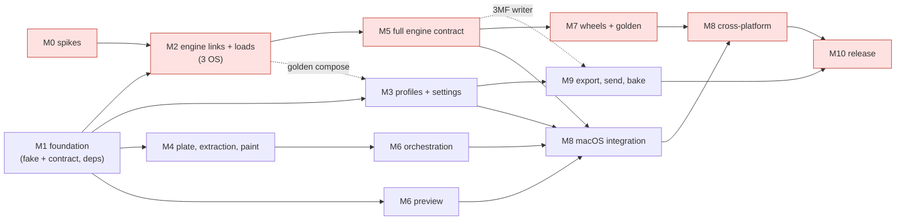
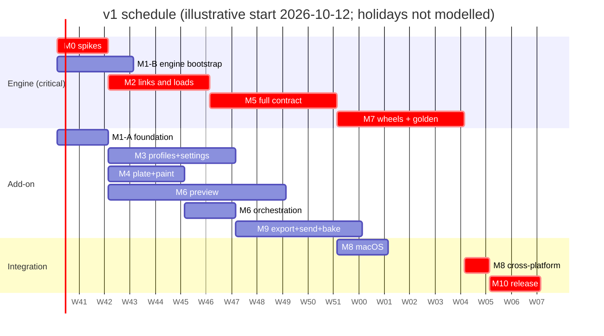

# Implementation plan

Status: draft for review, 2026-10-09. Read [01-architecture-overview.md](../design/01-architecture-overview.md) first. The interface every track builds against is [04-engine-api.md](../design/04-engine-api.md); licensing rules are in [compliance.md](../publishing/compliance.md).

## Summary

| | |
|---|---|
| **Order of work** | Phase 0 spikes (2 weeks) alongside the M1 foundation stacks. Then the engine track and three add-on tracks run in parallel; add-on tracks build against the fake engine until M8. |
| **Effort** | About **190 engineer-days (ed)**, **~225 ed with 20 % contingency** |
| **Critical path** | M0 → M2 → M5 → (M8-macOS ∥ M7) → M8 cross-platform → M10, with Windows and Linux link work in Phase 0 and M2. **19 weeks base; plan on 20–24 weeks** to v1 |
| **Throughput assumption** | Four implementation streams (T1 engine; T2, T3, T4 add-on; T5 and T6 work taken by whichever add-on stream is free), each a worktree-isolated agent session supervised by the maintainer. **One human reviewer** (the maintainer) at **10–15 PRs a week**. Review is the binding constraint; when it backs up, add-on streams pause before the engine stream does |
| **How code lands** | `gh stack` PR stacks of small layers; independent stacks run in parallel |
| **First stack** | M1-A "foundation" (§10) |

### Ground rules
- **04 is the contract.** A stack that changes the API carries, in order: 04 → stub → contract tests → fake → engine → add-on adapter (04 §11).
- **Stacked PRs.** `gh stack init` → commit → `gh stack add <branch>` → … → `gh stack submit`. Branches are `m<N>/<slug>`. A layer that grows past ~400 changed lines (excluding generated files and vendored patches) is split. Each layer is green on its own where possible; **M2's patch layers are not green until the link layer** (`m2/engine-cmake-root`), which is stated in their PR descriptions.
- **Parallel work.** One agent per stack with `isolation: "worktree"`, a self-contained brief and no file overlap with other running stacks; dependent stacks are serialized or rebased with `gh stack rebase`.
- **Reviews** use a worktree and end in approve or request changes, never "approve with a fix". **PRs that change anything visible in Blender include screenshots** (per backend where relevant).
- **No spike code and no research notes on `main`.** Only findings land, as doc updates.
- **Compliance from the first binary.** Any layer that publishes a binary (the M1-B deps release assets, M7 TestPyPI) also publishes the licence files, `NOTICE`, a source pointer and a source tarball (compliance.md §5).

---

## 1. Phase 0: de-risking spikes

All three start on day 1 on throwaway branches. Results land as one docs PR (`m0/spike-results`). **The in-process vs out-of-process decision is made at the end of week 2**, from (b) and (c).

| Spike | Timebox | Risk it retires |
|---|---|---|
| (a) GPU preview on Metal, Vulkan and OpenGL | 4 d | R2: the Python `gpu` module can't do chunked vertex pulling at 10M-move scale |
| (b) libslic3r module slicing a cube in Blender 5.1.2 on macOS arm64 | 4 d | R1: symbol, TBB or allocator clashes crash Blender |
| (c) The same on Windows and Linux, plus the trimmed deps build | 4 d of work plus CI wall time | R1 on the other two platforms, R9 (Windows GMP/MPFR), deps portability |

### (a) GPU spike
**Do.** In GUI Blender 5.1.2 on each backend (macOS Metal; Windows or Linux with Vulkan and with OpenGL):
1. Compile a `GPUShaderCreateInfo` shader with `FLOAT_2D` and `UINT_2D` samplers, `texelFetch`, `gl_InstanceID`, push constants and a std140 UBO.
2. Pack 10M synthetic moves into **per-chunk textures** (~1M moves each, texel 0 duplicating the previous chunk's last move; 03 §7.2), building one chunk per timer tick.
3. Draw one `draw_instanced` per chunk with per-chunk range clamping (03 §7.4); scrub by changing uniforms and instance counts; confirm an empty range skips the draw.
4. Measure `gpu.types.Buffer` creation from numpy (zero-copy or not), POST_VIEW depth against scene geometry, and FPS.
5. Side checks: workspace creation in code, `bpy.app.timers` in `-b`, brush raycast tool registration.

**Pass.**
- Screenshots of the reference scene on Metal, Vulkan and OpenGL agree within a perceptual threshold: SSIM ≥ 0.98 and ≤ 0.5 % of pixels with ΔE2000 > 5. No missing or doubled segments at chunk boundaries.
- ≥ 30 FPS with 5M visible segments on an M1/M2-class Mac and a GTX 1660-class GPU; **≥ 30 FPS with 2M visible segments on an integrated GPU** (Intel Iris Xe-class or an 8 GB Apple Silicon Mac) within its default VRAM budget. Scrubbing creates no textures.
- Building one 1M-move chunk (pack, `Buffer`, three textures) takes ≤ 40 ms per tick.
- Toolpaths occlude correctly against scene meshes.

**If it fails.**

| Failure | Change |
|---|---|
| Integer textures unsupported on a backend | Pack meta into RGBA32F with `floatBitsToUint`; +2 d in M6 |
| `Buffer` from numpy copies through a list | Smaller chunks per tick; the partial preview masks slower upload |
| `draw_instanced` or `gl_InstanceID` unusable | Expanded non-instanced VBOs (~4× memory), lines LOD above 5M segments; M6 preview +4 ed |

### (b) Native spike, macOS
**Do.** Build Orca's deps (untrimmed is fine) and a nanobind abi3 module linking libslic3r statically with hidden visibility; expose one function that slices an STL with one flattened profile. Import it in Blender 5.1.2 and slice a 20 mm cube.

**Pass.**
- Import and slice work in GUI and `-b`; 50 consecutive slices with no crash and **RSS growth under 20 MB over slices 10–50**, compared with the official Orca release binary at the same tag.
- `nm -gU` exports only `PyInit_*`; no TBB or Boost symbols leak.
- Blender's own TBB users still work after slicing (a Geometry Nodes evaluation, a remesh, a Cycles CPU render). Record which TBB libraries are loaded (expected: Blender's `libtbb` 2022.3, no `tbbmalloc_proxy`).
- G-code matches the official Orca binary apart from header lines.

### (c) Native spike, Windows and Linux
**Do.** On `windows-2022` (MSVC 2022, `/MD`) and in `manylinux_2_28_x86_64`: build the trimmed deps list (02 §3.4), link the spike module from (b), import it in Blender 5.1.2 on each OS, slice the cube, and exercise Blender's TBB users as in (b). Decide **Windows GMP/MPFR**: build from source with MSVC, or vendor Orca's prebuilt DLLs via `delvewheel` with provenance (compliance.md §4).

**Pass.**
- `dumpbin /dependents` and `ldd` show only system and CRT libraries, plus any deliberately vendored DLLs; no Blender library is interposed.
- Slicing and Blender's TBB users work in the same session on both OSes; record which TBB and malloc-proxy libraries Blender loads there.
- The GMP/MPFR decision is recorded in 02 §3.4.
- Cold deps build ≤ 60 min per platform; warm cache restores in < 5 min.

**If (b) or (c) fails.**

| Failure | Change |
|---|---|
| TBB clash fixable by build flags | Version script, `-Bsymbolic`, renamed oneTBB inline namespace via a deps patch; +2–3 d in M2 |
| Unfixable in-process clash or allocator crash | **Out-of-process engine**: the same wheel in a child process started with Blender's bundled Python, results via shared memory. Store-compliant; the 04 API is unchanged. +2 weeks on the critical path |
| A dep won't build on MSVC | vcpkg for that dep at the same version, pinned; golden tests confirm parity |
| manylinux_2_28 toolchain too old | `manylinux_2_34` after checking Blender's glibc floor |

Spike (c)'s deps work is productionised as M1-B layer 3, which starts after (c) reports.

### Phase 0 admin (0.5 d)
- Draft and send moderator query v2 (drafted locally, outside the repo; compliance.md §8). Off the critical path.
- Name checks (trademark, store, PyPI) for product, engine and repo (01 §9).

---

## 2. Tracks and dependencies

| Track | Owns | Milestones |
|---|---|---|
| **T1 Engine** | `engine/` | M1-B, M2, M5, M7 |
| **T2 Profiles and settings** | `core/profiles`, `blender/config_pg.py`, settings UI | M1-A, M3 |
| **T3 Preview** | `core/preview_data.py`, `blender/preview/` | M6 preview, M9 bake |
| **T4 Plate, paint, orchestration** | `blender/extract.py`, `paint/`, `engine/jobs.py`, `cache.py` | M4, M6 orchestration, M8 |
| **T5 Export and networking** | `core/network/`, `gcode_export.py`, printer prefs | M9 |
| **T6 Packaging, compliance, CI** | `.github/`, `gen_third_party.py`, release tooling | M1, M7, M10 |



T2, T3 and T4 need nothing native until M8; they start when M1-A merges and use `fake_engine` (synthetic slices, plus real Orca G-code through `from_gcode`). T5 needs the real engine only for `.gcode.3mf` and hardware tests. The contract suite keeps the fake honest.

---

## 3. Milestones and schedule

| M | Goal | ed | Weeks | Depends on |
|---|---|---|---|---|
| **M0** | Spikes (a), (b), (c); moderator query; name checks | 12.5 | W1–W2 | — |
| **M1** | Foundation: monorepo, stub, contract suite, fake, add-on skeleton, CI; engine submodule and deps CI | 14 | W1–W3 | — (M1-B layer 3 after spike (c)) |
| **M2** | Engine links and loads on three OSes: patch series, `libslic3r_min`, Orca tests, config functions, tab layout, cube slice in Blender | 20 (18–22) | W3–W6 | M0, M1 |
| **M3** | Profiles and settings | 17 | W3–W7 | M1 (golden: M2) |
| **M4** | Plate, extraction, painting | 13 | W3–W5 | M1 |
| **M5** | Full engine contract incl. ported glue | 22 (20–25) | W7–W11 | M2 |
| **M6** | Orchestration (after M4) and preview | 25 | W3–W9 | M1, M4 |
| **M7** | Three-platform wheels, load matrix, TestPyPI, golden suite, perf | 24 (20–28) | W12–W16 | M5 |
| **M8** | Real-engine integration: macOS after M5; cross-platform after M7 | 9 | W12–W13, W17 | M3, M5, M6; M7 |
| **M9** | Export, OctoPrint, Moonraker, Bambu LAN, keychain; bake | 21 | W8–W12 | M3, M5 (3MF) |
| **M10** | Compliance completion, About panel, renames, release pipeline, v1.0 | 11 | W18–W19 | M8, M9 |
| | **Total** | **≈ 190** (≈ 225 with contingency) | **19 base, plan 20–24** | |



**Critical path:** M0 2 w → M2 4 w → M5 5 w → M7 5 w → M8 cross-platform 1 w → M10 2 w = **19 weeks**; M8-macOS runs alongside M7. With contingency and single-reviewer latency, **plan on 20–24 weeks**. The add-on tracks have several weeks of float.

**How the estimates were reconciled.** Per-item estimates from the earlier engine (02, E0–E7) and add-on (03, M0–M13) milestone tables, mapped to this plan:

| Plan | From 02 | From 03 | Earlier plan | Now | Why |
|---|---|---|---|---|---|
| M0 | — | M0 spikes 4 | 10 | 12.5 | Spike (c) now links and loads on Windows and Linux |
| M1 | E0 skeleton/deps 2–3 | M1 skeleton 4 | 13 | 14 | Fake split, DCO and compliance files, licence files in the first binary layer |
| M2 | E1 link 4–7, E2 binding 3–5 | — | 10 | 20 | 15–18-file patch series, stubs, tab-layout overrides (2–3), Windows/Linux link |
| M3 | — | M2 profiles 8, M3 settings 9 | 17 | 17 | |
| M4 | — | M4 bed/plate 5, M5 extraction/paint 8 | 13 | 13 | |
| M5 | E3 contract 5–8 (+4–6 requests) | — | 12 | 22 | `validating` state, ported CLI/GUI glue (02 §5.9, ~5–8), `filament`/`nozzle` |
| M6 | — | M6 orchestration 6, M7 preview 14, M8 legend 4 | 24 | 25 | Per-chunk texture design |
| M7 | E4 platforms 5–10, E5 golden 4–6 | — | 13 | 24 | Official-binary oracle, three-OS load matrix, compliance in the TestPyPI layer |
| M8 | — | M12 real-engine 6 | 8 | 9 | Split into macOS and cross-platform |
| M9 | — | M9 export 7, M10 Bambu 7, M11 bake 4 | 17 | 21 | Bambu do-not list, authorization handling, hardware matrix |
| M10 | E6 compliance 2–3, E7 rebase 2–3 | M13 release 3 | 11 | 11 | Much compliance moved earlier; renames and mirroring added |
| Totals | 27–45 | 99 | 148 | ≈ 190 | 02's F0 CLI backend (2–3) dropped (04 A.3) |

---

## 4. Milestone details and PR stacks

Acceptance tests are what the last layer of each stack shows in CI or in a recorded manual run.

### M0: spikes (12.5 ed)
Deliverables: spike reports in PR descriptions, updated docs. Acceptance: each §1 criterion marked pass, fail-with-fallback or partial; the in-process decision recorded at the end of week 2.

| Layer | Branch | Content |
|---|---|---|
| 1 | `m0/publishing-docs` | name-check results (moderator query is drafted outside the repo) |
| 2 | `m0/spike-results` | Findings folded into 02/03/04 and this plan |

### M1: foundation (14 ed)
Acceptance: the contract suite passes against the fake on three OSes; headless Blender registers and unregisters cleanly; `extension build --split-platforms` and `validate` pass; the deps job produces cached prefixes and release assets with licence files on three platforms.

**Stack M1-A (foundation)**, brief in §10:

| Layer | Branch | Content |
|---|---|---|
| 1 | `m1/repo-layout` | `engine/`, `addon/` skeletons; SPDX boundary check (excluding submodule, profile JSON, patches); DCO check; PR template with provenance checkbox |
| 2 | `m1/api-stub` | `engine/python/slicewright_engine/__init__.pyi` from 04 §3; stub-vs-doc sync test |
| 3 | `m1/contract-suite` | `addon/tests/contract/`, backend-parametrized; skips until a backend exists |
| 4 | `m1/fake-engine-api` | Fake module functions, schema fixture, `compose`/`normalize`/`eval_condition` |
| 5 | `m1/fake-engine-jobs` | `SliceJob` state machine incl. `validating`, errors, `Busy`, synthetic slicing |
| 6 | `m1/fake-engine-gcode` | `from_gcode` for both tag dialects |
| 7 | `m1/addon-skeleton` | Manifest, ordered registration, prefs, logging, adapter with API check and diagnostic panel |
| 8 | `m1/ticking-runner` | `core/ticking.py` |
| 9 | `m1/addon-ci` | `addon-ci.yml`: pytest ×3 OS, headless Blender, extension build/validate |

**Stack M1-B (engine bootstrap)**, based on `m1/repo-layout`:

| Layer | Branch | Content |
|---|---|---|
| 1 | `m1/engine-submodule` | Orca submodule at **v2.4.2** (latest stable, 2026-07-07); **re-verify every file:line in 02 at that tag**; patch-apply tooling; patch header lint |
| 2 | `m1/engine-deps-superbuild` | Patch 0007 (overridable deps list), trimmed deps driver, GMP/MPFR choice from spike (c) |
| 3 | `m1/engine-ci-deps` | Productionised spike (c): `engine-ci.yml` deps job on three platforms, cache, release-asset tarballs **with** dep licence files, `NOTICE`, source pointer and dep source tarball |

### M2: engine links and loads (20 ed)
Acceptance: Orca's Catch2 subset passes; `nm` shows no OCCT, OpenCV, OpenSSL or mcut symbols; config functions pass contract tests against the real module; `run()` slices a cube inside Blender 5.1.2 headless **on all three OSes**; read-only functions work during a slice.

| Layer | Branch | Content |
|---|---|---|
| 1 | `m2/patch-headless-cmake` | 0001: `SLIC3R_HEADLESS_MINIMAL`, REQUIRED finds and link items removed, exclusions |
| 2 | `m2/patch-step-decouple` | 0002: `STEP_fwd.hpp` and include changes |
| 3 | `m2/patch-model-import-guards` | 0003 |
| 4 | `m2/patch-hollowing` | 0004 plus the `generate_interior` stub |
| 5 | `m2/patch-md5-boost` | 0005: Boost MD5, `Utils.hpp:35` include removed |
| 6 | `m2/patch-remove-mcut` | 0006 |
| 7 | `m2/engine-cmake-root` | Our root CMake, `src/stubs/` (incl. `ColorSpaceConvert`), `libslic3r_min` links on macOS; first green layer |
| 8 | `m2/engine-link-win-linux` | Links on Windows and Linux; GMP/MPFR per decision |
| 9 | `m2/orca-catch2-subset` | Our test source list, symbol regression guards |
| 10 | `m2/binding-skeleton` | `version`, `enums`, `set_log`, dirs, `licenses` placeholder |
| 11 | `m2/binding-config` | `config_schema`, `normalize_config`, `compose_config`, `eval_condition`, `ConditionContext` |
| 12 | `m2/tab-layout-gen` | Generator, override file, schema-coverage check (2–3 ed) |
| 13 | `m2/binding-run-cube` | Minimal job + `run()`, Blender load-and-slice on three OSes |
| 14 | `m2/export-fixtures` | `export_fixtures.py`; the fake switches to them |

### M3: profiles and settings (17 ed)
Acceptance: unit tests for resolve, compat, user presets, importer; golden profiles (~50 combinations) match `--export-settings`; index build ≤ 25 ms per tick; headless ConfigPG generation and page drawing.

| Layer | Branch | Content |
|---|---|---|
| 1 | `m3/profiles-source-index` | Zip source, chunked cached index |
| 2 | `m3/profiles-resolve` | 03 §3.5 behaviour + tests |
| 3 | `m3/profiles-compat` | 03 §3.6 behaviour + tests via `ConditionContext` |
| 4 | `m3/profiles-models-picker` | Vendor → model → nozzle picker |
| 5 | `m3/config-pg` | Generated ConfigPG, three roles |
| 6 | `m3/settings-pages` | Pages, filter, modes, custom drawers |
| 7 | `m3/settings-rules` | Rule table + schema-existence test |
| 8 | `m3/user-presets` | Save, diff, revert, embed, secret stripping |
| 9 | `m3/preset-importer` | OrcaSlicer/BambuStudio import |
| 10 | `m3/golden-compose` | Golden profile tests |

### M4: plate, extraction, painting (13 ed)
Acceptance: headless tests for transforms, negative scale, modifiers, instances and unit scale; INT paint attributes survive subdivision and are writable through bmesh; paint arrays match expected faces; overlay and brush work in a GUI smoke run (screenshots).

| Layer | Branch | Content |
|---|---|---|
| 1 | `m4/units-bed-draw` | Units, procedural bed, exclude areas |
| 2 | `m4/plate-ops` | Plate collection, drop/center, out-of-volume checks |
| 3 | `m4/extract` | Extraction, input keys, pre-slice checks (manifold on Slice/Check only) |
| 4 | `m4/paint-attributes` | INT face attributes, edit-mode assign via bmesh, select overhangs |
| 5 | `m4/paint-overlay` | Paint overlay |
| 6 | `m4/paint-brush` | Object-mode brush |
| 7 | `m4/arrange-ui` | Arrange operator (fake; real in M8) |

### M5: full engine contract (22 ed)
Acceptance: the whole contract suite passes against the real module on macOS; paint tests incl. `paint_out_of_range`; cancel latency per stage; `Busy`; GIL released during waits; RSS growth < 20 MB over slices 10–50; stats sums; enforcer-with-supports-off recorded in 04 A.2 #11; each 02 §5.9 glue item covered by a test.

| Layer | Branch | Content |
|---|---|---|
| 1 | `m5/job-thread-lock` | Engine thread, lock, `start/poll/cancel/result/run` |
| 2 | `m5/job-validating-errors` | `validating` state, error mapping, `ValidationError` via `result()` |
| 3 | `m5/add-object-arrays` | Array inputs, `set_config` ordering, object-level extruder, overrides scope |
| 4 | `m5/paint-facets` | Paint → `FacetsAnnotation`, `paint_out_of_range` |
| 5 | `m5/moves-soa` | Chunked conversion, `filament`/`nozzle`, layer guarantees, `gcode_line_ends` |
| 6 | `m5/stats-issues` | `stats`, unified issues |
| 7 | `m5/glue-config` | `construct_full_config` GUI path, unknown-key filter, extruder params and speed tables, `set_extruder_filament_info` |
| 8 | `m5/validate-arrange` | `validate()` caching; `arrange()` with exclude-area and tower glue |
| 9 | `m5/thumbnails` | `set_thumbnails` through Orca's callback |
| 10 | `m5/gcode-3mf-glue` | `write_gcode_3mf` with the PlateData port |
| 11 | `m5/filename-wipetower` | `output_filename`, bed-frame `wipe_tower` |
| 12 | `m5/contract-real-macos` | Contract suite against the real wheel |

### M6: orchestration and preview (25 ed)
Acceptance: headless orchestration tests with the fake (start, validating, poll, cancel, errors, staleness, cache reconnect, recovery copies); `preview_data` unit tests incl. chunk boundaries and empty ranges; GUI screenshots per backend; a 10M-move `from_gcode` print previews at the spike (a) targets; legend times sum to the total.

Orchestration stack (T4, after M4):

| Layer | Branch | Content |
|---|---|---|
| 1 | `m6/slice-controller` | Persistent timers, `validating`, `UILayout.progress`, cancel watcher, typed errors, `load_pre` cancel |
| 2 | `m6/recovery-copy` | Throttled `save_as_mainfile(copy=True)` recovery copies |
| 3 | `m6/staleness-cache` | Invalidation, chunked cache writes, reconnect |
| 4 | `m6/thumbnails-render` | Offscreen thumbnails → `set_thumbnails` |

Preview stack (T3):

| Layer | Branch | Content |
|---|---|---|
| 1 | `m6/preview-data` | Numpy chunking and packing, view scalars, marker lists |
| 2 | `m6/preview-shader-compile` | Create-info shaders, UBO, template batches |
| 3 | `m6/preview-chunk-draw` | Per-chunk textures, per-chunk draw, range clamping, empty-range skip |
| 4 | `m6/preview-tubes` | Tube shading pass |
| 5 | `m6/preview-passes` | Travel, markers, nozzle, lines LOD |
| 6 | `m6/preview-scrub-views` | Navigation operator, view modes, ghosting |
| 7 | `m6/preview-upload-lifecycle` | One chunk per tick, VRAM budgets (iGPU-aware), load/undo hooks |
| 8 | `m6/legend-summary` | Legend, summary |
| 9 | `m6/inspector-gcode` | Move inspector, G-code window |

### M7: wheels and golden suite (24 ed)
Acceptance: abi3 wheels for three platforms install via `extension build` and slice in Blender 5.1.2 on each OS; the contract suite passes on each; TestPyPI publish with full compliance artefacts; golden G-code equal to the official Orca binary at the pinned tag for ~20 models × 8 profiles, or each diff explained; glue fields match field by field; determinism; benchmarks recorded (incl. the 10M-move reference that decides 04 A.2 #5).

| Layer | Branch | Content |
|---|---|---|
| 1 | `m7/ci-linux-wheel` | manylinux build, version script, auditwheel |
| 2 | `m7/ci-windows-wheel` | MSVC build, delvewheel (CRT, GMP/MPFR if vendored) |
| 3 | `m7/ci-macos-sign` | delocate, signing before upload |
| 4 | `m7/blender-load-matrix` | Load + slice + contract suite on three OSes |
| 5 | `m7/testpypi-publish` | `release-engine.yml` to TestPyPI; `gen_third_party.py`, `NOTICE`, `SOURCE.txt`, PyPI long-description source link, source tarball and mirror upload; no sdist |
| 6 | `m7/orca-oracle` | Official Orca release binary at the pinned tag as the CLI oracle |
| 7 | `m7/golden-corpus` | Corpus, normaliser, diff report, painted inputs via `_testing` 3MF |
| 8 | `m7/determinism-perf` | Determinism test, tracked benchmarks |

### M8: real-engine integration (9 ed)
Acceptance: headless end-to-end per OS (extract → compose → slice → preview data → export) with G-code equal to the oracle for three reference scenes; arrange verified; scripted GUI smoke per OS with screenshots; install from the self-hosted repo URL works.

| Layer | Branch | Content |
|---|---|---|
| 1 | `m8/adapter-real-default` | Real engine by default (local macOS wheel); fake behind a dev flag. After M5 |
| 2 | `m8/integration-fixes-macos` | Fixes from the first real runs. After M5 |
| 3 | `m8/arrange-real` | Arrange against the real engine. After M5 |
| 4 | `m8/fetch-wheels` | `fetch_wheels.py` (pinned, hashed), manifest `wheels`. After M7 |
| 5 | `m8/e2e-headless` | End-to-end on three OSes. After M7 |
| 6 | `m8/gui-smoke` | Scripted GUI smoke tests, screenshots |

### M9: export, send, bake (21 ed)
Acceptance: fake-server tests for OctoPrint, Moonraker, implicit FTPS and MQTT on three OSes; real upload-and-start on one OctoPrint and one Klipper machine; Bambu send on available hardware in LAN Developer Mode; authorization denial stops cleanly with the Developer Mode message; the 03 §8.4 do-not list verified in review; secrets never in the .blend; network operators disabled when online access is off; bake counts and a Cycles render.

| Layer | Branch | Content |
|---|---|---|
| 1 | `m9/export` | G-code and `.gcode.3mf` export, default filenames |
| 2 | `m9/net-core` | Non-blocking sockets, TLS, multipart, fake servers |
| 3 | `m9/secrets` | Keychain backends and file fallback |
| 4 | `m9/printers-prefs` | Physical printers UI, online-access gating |
| 5 | `m9/octoprint` | OctoPrint client |
| 6 | `m9/moonraker` | Moonraker client |
| 7 | `m9/bambu-ftps` | Implicit FTPS with TLS session reuse |
| 8 | `m9/bambu-mqtt` | Minimal MQTT, TOFU, AMS mapping, "unsupported by Bambu" label, stop on authorization denial |
| 9 | `m9/bake` | Bake to Curves and mesh (T3, separate stack) |

### M10: compliance completion and release (11 ed)
Acceptance: the release checklist (§9) is green.

| Layer | Branch | Content |
|---|---|---|
| 1 | `m10/names-rename` | Final product, engine and repo names in code, docs and manifest |
| 2 | `m10/third-party-final` | Full licence manifest on all platforms, LGPL notices, libnoise text, qhull notices |
| 3 | `m10/about-panel` | About & licences panel (compliance.md §6) |
| 4 | `m10/manifest-final` | Self-hosted and store manifest variants, `copyright` year check |
| 5 | `m10/compliance-scan` | Asset, `__pycache__`, size and SPDX checks on zips |
| 6 | `m10/release-pipeline` | Release-asset zips, Pages index rewrite, optional store upload |
| 7 | `m10/user-docs` | User guide, reviewer notes (threading, network use) |
| 8 | `m10/rebase-dryrun` | Orca rebase dry run; may slip to v1.0.1 |

---

## 5. Testing strategy

| Level | What | Where | When |
|---|---|---|---|
| **Unit** | `core/` (profiles, geometry, hashing, preview packing, stats, network against fake servers, ticking), fake engine | stock Python 3.13, three OSes | every add-on PR |
| **Contract** | 04 conformance | fake on every PR; real wheel on three OSes in engine CI | every PR touching either side |
| **Engine C++** | Orca Catch2 subset against `libslic3r_min` | engine CI, three OSes | every engine PR |
| **Engine Python** | paint, cancel latency, `Busy`, GIL release, RSS loop, stats sums, glue items | engine CI | every engine PR |
| **Headless Blender** | register hygiene, ConfigPG, extraction, paint, orchestration, cache, recovery, bake counts, end to end | Blender 5.1.2 `-b --factory-startup`, three OSes | every add-on PR; end to end from M8 |
| **GUI smoke** | scripted slice, scrub, view switch, screenshots per backend, perceptual diff against references | manual or self-hosted runner | each milestone from M6, and release |
| **Golden G-code** | ours vs the official Orca binary at the pinned tag; ~20 models × 8 profiles; normalised | `engine-golden.yml`, Linux | weekly, every rebase, release |
| **Golden profiles** | `resolve` → `compose_config` → `normalize_config` vs `--export-settings`, ~50 combinations | engine-enabled add-on job | profile or engine changes |
| **Benchmarks** | wall time, peak RSS, cancel latency, preview FPS (incl. iGPU) | tracked, not gating | weekly |
| **Hardware** | OctoPrint, Klipper, Bambu as available | manual, recorded | M9 and release |

**CI matrix:** add-on unit + contract (fake), headless Blender, engine deps, engine wheel + Catch2 + pytest, wheel-in-Blender + contract (real), and extension build/validate run on macOS 14 arm64, Windows 2022 and Ubuntu 24.04 (manylinux_2_28). Golden G-code (weekly) and compliance (SPDX, licences, assets, DCO) run on Linux only.

---

## 6. Risk register

One ranked list, merged from the former engine and add-on risk tables. L = likelihood, I = impact.

| # | Risk | L / I | Mitigation | Plan change if it fires |
|---|---|---|---|---|
| R1 | **In-process clash or crash**: two oneTBB runtimes (2021.5 static, 2022.3 dynamic), allocator proxies, Boost, MSVC runtime; Windows and Linux unverified | Med / High | Hidden visibility, version script, two-level namespaces; spikes (b) and (c); Blender load test on three OSes in CI | Out-of-process engine, decided end of W2; +2 weeks |
| R2 | **Python `gpu` limits**: no sub-region texture update, `Buffer` copies, instancing quirks per backend | Med / High | Per-chunk textures; spike (a) on all backends and an iGPU | Expanded VBOs, lines LOD above 5M; +4 ed in M6 (off the critical path) |
| R3 | **Review bottleneck**: one reviewer, ~100 layers | High / Med | Small layers, critical path first, screenshots and clear briefs | Pause add-on streams; extend the schedule (no scope cut, §8) |
| R4 | **Ported glue parity**: `.gcode.3mf` PlateData, arrange areas, extruder tables drift from Orca, so firmware rejects files or G-code differs | Med / Med | 02 §5.9 table as checklist; field-by-field golden tests vs the official binary; hardware matrix | Extra M5/M7 days; Bambu send marked experimental |
| R5 | **Native crash or OOM** takes Blender down | Med / High | Recovery copies, memory warnings, conservative threads | Out-of-process engine (as R1) |
| R6 | **Trimming patches grow** into a rebase tax | Med / Med | Stubs in our repo, upstream `SLIC3R_HEADLESS_MINIMAL`; refs re-verified at the pin | > 600 changed lines at M2: stop and upstream first |
| R7 | **Config composition mismatch** with Orca | Med / Med | Orca's own `construct_full_config` with the GUI's arguments; golden profiles | — |
| R8 | **Memory at 10M+ moves** (CPU ~70 B/move, VRAM 28 B/move; iGPUs) | Med / Med | Chunked conversion and packing, budgets, LOD | Peak RSS > 3 GB at M7: pull compact output into M7 (+3 ed) |
| R9 | **Windows GMP/MPFR**: prebuilt DLLs or an MSVC source build | Med / Low | Decided in spike (c); provenance recorded | vcpkg at the same version |
| R10 | **Global state leaks between jobs** (`s_IsBBLPrinter`, extruder maps, caches) | Med / Med | One job per process; reset per start; alternating printer-family tests | — |
| R11 | **Bambu firmware or authorization drift** | Med / Med | Developer Mode only, stop on denial, clear UX, hardware matrix | Ship OctoPrint/Moonraker; Bambu send experimental |
| R12 | **Engine name or trademark collision** | Med / Med | Names chosen and registered before M7 TestPyPI | Rename before any PyPI upload |
| R13 | **Store rejects the AGPL wheel** (no allow-list slug) | High / Low | Self-hosted repository is the design default; moderator query | None |
| R14 | **Cancel latency**, non-cancellable finalization | Med / Low | Measure per stage; `throw_if_canceled` patches where it matters | — |
| R15 | **Show/enable rule coverage** | Med / Low | Grow from user reports | — |
| R16 | **Painting UX** (per-face only; some modifiers drop attributes) | Low / Med | Edit-mode path, warnings, subdivision hint | — |
| R17 | **Undo/reload vs runtime state** | Med / Low | `session_uid` registry, handler resets, content keys | — |
| R18 | **Timer-driven networking** edge cases | Med / Low | Blocking-mode tests, fake servers | — |
| R19 | **Licence surprises in the link set** | Low / Med | Generated manifest that fails on unknowns | — |
| R20 | **CI cost** (3 × 45-min deps) | High / Low | Deps cache and release assets; weekly golden | Larger runners for deps only |
| R21 | **abi3 tags rejected** by `extension build` | Low / Low | Verify in M7 | `cp313` tags |

---

## 7. Decisions still open

See 01 §9: names, monorepo approval, the moderator query, test hardware, signing and maintainer identity. Decided: Orca pinned to **v2.4.2**; no v1 cut line (§8).

---

## 8. v1 scope decision

**Decided 2026-10-09: no cut line.** Everything in the design ships in v1, including the items the technical review proposed deferring (object-mode brush, preset importer, engine Arrange, move inspector and G-code window, cross-reload cache, auto re-slice, full settings search and rule table, custom bed editor, workspace creation) and **H2D send** (dual-nozzle AMS mapping, about +3 ed in M9). There is no deadline. v1.1 and v2 are for improvements and new features, not deferred v1 work. The schedule above already includes every item except H2D send.

---|---|---|---|
| Object-mode paint brush | Edit-mode Select + Assign | 3 | no |
| Orca/Bambu user-preset importer | — | 2 | no |
| Engine Arrange | Drop to bed, Center | 4 (M5 2, M4 1, M8 1) | partly (M5) |
| Move inspector and G-code window | Legend and summary | 2 | no |
| Cross-reload slice cache | In-session cache | 2 | no |
| Auto re-slice | Manual Slice | 1 | no |
| Settings search beyond a basic filter; rule table trimmed to ~10 groups | Basic page filter | 3 | no |
| Custom bed-polygon editor and workspace creation | Rectangular custom beds | 2 | no |
| Determinism and perf suites as release gates | Tracked, non-gating | 2 | yes (M7) |
| H2D send | Already v1.1 in the design (03 §8.4); multi-nozzle profiles still compose and slice in v1 | 0 (already excluded) | no |
| **Total** | | **≈ 21 ed** | **≈ 4 ed on the critical path** |

Effect if accepted: about 21 ed (~10 %) less work, mostly add-on float, and roughly one week off the critical path (M5 and M7), giving 19–23 weeks.

---

## 9. v1 release checklist

**Names and repository**
- [x] Product and engine names chosen: **Slicewright** / `slicewright-engine` (web check passed 2026-10-09)
- [ ] Attorney trademark clearance for Slicewright (USPTO, EUIPO, WIPO; classes 7, 9, 40, 42)
- [ ] `slicewright-engine` registered on PyPI (before M7 TestPyPI)
- [ ] Repository renamed `BlenderSlicer` → `slicewright`; README, manifest and docs updated

**Engine (`engine-v1.0.0`)**
- [ ] `engine/LICENSE` (AGPL-3.0); `License-Expression = "AGPL-3.0-only"` and `License-File`s
- [ ] `THIRD_PARTY_LICENSES` and `licenses/` generated from the link map on every platform; includes `calib.cpp` (GPL-3.0), SmallAreaInfillFlowCompensator, ArcWelder, the CuraEngine-derived files, MIT/BSL/SGI-B-2.0/ISC items, admesh, agg; LGPL-3.0, LGPL-2.1 and GPL-3.0 texts and "uses X under the LGPL" notices; the supplied libnoise text; qhull `COPYING.txt` with modification and origin notices
- [ ] Symbol guards pass: no OpenSSL, OCCT, OpenCV or mcut; minilzo not linked
- [ ] Prebuilt-DLL provenance (URL, version, hash) recorded for any vendored Windows DLL
- [ ] `NOTICE`: modified version of OrcaSlicer <tag/commit>, each patch's purpose and date, ported glue files
- [ ] `SOURCE.txt`, `version()["source_url"]` and the PyPI long description point at the release and tarball; no sdist
- [ ] Source tarball attached, rebuilt once on a clean runner, mirrored (Software Heritage, Zenodo), retention indefinite
- [ ] Profiles zip contains JSON only; `check_unused_setting_id.py` and `FlyingBear/error_hull_show` excluded
- [ ] SPDX `AGPL-3.0-only` on every file we wrote under `engine/`
- [ ] Wheels via trusted publishing; hashes recorded; debug symbols on the release

**Add-on (`addon-v1.0.0`)**
- [ ] Root `LICENSE` and `addon/LICENSE` (GPL-3.0); SPDX `GPL-3.0-or-later` on every `.py`
- [ ] `CONTRIBUTING.md` in place; DCO check green on all commits
- [ ] Reviewer confirmation that no translated Orca/libvgcode code is under `addon/`
- [ ] Add-on `NOTICE`: credits, non-affiliation, AGPL §13 note, engine licence and source pointers
- [ ] Self-hosted manifest: `license = ["SPDX:GPL-3.0-or-later", "SPDX:AGPL-3.0-only"]`; every `copyright` entry starts with a year (validated); `platforms` = three; pinned `wheels`
- [ ] `[permissions]`: `files` and `network` only, terse, no trailing period
- [ ] No binary assets, `__pycache__` or `.pyc`; zips ≤ 150 MB
- [ ] Network only on user action, gated on `online_access`; no telemetry, update checks or downloads
- [ ] No `threading` import in `addon/slicewright` (CI grep)
- [ ] About panel: versions, Orca tag/commit, patches, source link, licence summary, no-warranty text, LGPL copyright notices, AGPL §13 note, licence viewer
- [ ] `extension validate` passes on all zips; install from zip and from the repo URL tested on three OSes

**Bambu**
- [ ] 03 §8.4 do-not list verified (code review; grep for cloud hostnames and plugin names)
- [ ] Authorization denial stops and points to Developer Mode (tested); "unsupported by Bambu" label shown

**Distribution and store**
- [ ] Zips hosted as GitHub Release assets; Pages serves only `index.json` and HTML
- [ ] Moderator query v2 sent; date, link and answer recorded in `docs/publishing/`
- [ ] Store submission only with consent, using the GPL-only manifest plus the disclosure sentence (compliance.md §8); listing links the engine source
- [ ] Engine and add-on Releases cross-link each other
- [ ] Lawyer consultation points listed (compliance.md §11) and the decision to consult recorded

**Quality gates**
- [ ] Golden G-code clean or every diff explained; glue fields match
- [ ] Contract suite green against the released wheels on three OSes
- [ ] GUI smoke on Metal, Vulkan, OpenGL and an iGPU, screenshots attached
- [ ] Hardware sends recorded

---

## 10. First PR stack after approval

**Stack M1-A, "foundation".** No native code and no spike results needed, so it starts the day the design is approved, alongside the spikes and M1-B.

```sh
gh stack init m1/repo-layout          # layer 1
#   … commit …
gh stack add m1/api-stub
gh stack add m1/contract-suite
gh stack add m1/fake-engine-api
gh stack add m1/fake-engine-jobs
gh stack add m1/fake-engine-gcode
gh stack add m1/addon-skeleton
gh stack add m1/ticking-runner
gh stack add m1/addon-ci
gh stack submit && gh stack view
```

| # | Branch | Contents | Done when |
|---|---|---|---|
| 1 | `m1/repo-layout` | `engine/` and `addon/slicewright/` skeletons (the `LICENSE` files and `CONTRIBUTING.md` already exist); `compliance.yml` with the SPDX boundary check (excluding submodule, profile JSON, patches) and DCO check; PR template with the provenance checkbox | Compliance job green; tree matches 01 §7 |
| 2 | `m1/api-stub` | `engine/python/slicewright_engine/__init__.pyi` exactly as 04 §3; test that the stub matches the 04 code block | Stub test green; `mypy` checks the stub |
| 3 | `m1/contract-suite` | `addon/tests/contract/` with a `backend` fixture: signatures, dtypes, shapes, layer guarantees, states (incl. `validating`), errors, version rule | Collects and skips cleanly with no backend |
| 4 | `m1/fake-engine-api` | `addon/tests/fake_engine/`: module functions, small hand-written schema fixture (until M2 layer 14) | Contract tests for module functions green |
| 5 | `m1/fake-engine-jobs` | `SliceJob` with the 04 §8 state table, `Busy`, errors, synthetic slicing that advances on `poll()` | Full contract suite green against the fake |
| 6 | `m1/fake-engine-gcode` | `from_gcode` for both dialects, G2/G3, relative/absolute E | Parses two tiny self-generated CC0 sample files into a valid result |
| 7 | `m1/addon-skeleton` | Manifest (placeholder name constant), ordered `register`/`unregister`, prefs, logging, adapter with the 04 §10 check and diagnostic panel | Headless register/unregister leaves no handlers or timers |
| 8 | `m1/ticking-runner` | `core/ticking.py`: chunked generators under a per-tick budget | Unit tests and a headless timer test (or direct drive) |
| 9 | `m1/addon-ci` | `addon-ci.yml`: pytest ×3, Blender 5.1.2 download and cache, headless tests, `extension build --split-platforms` + `validate` | All jobs green on the stack's top |

**In parallel on day 1:**

| Work | Who | Isolation |
|---|---|---|
| Stack M1-A | agent 1 | worktree |
| Stack M1-B layers 1–2, based on `m1/repo-layout` | agent 2 | worktree; starts once layer 1 is pushed |
| Spike (a) GPU | maintainer, or an agent driving a GUI session | throwaway branch |
| Spikes (b) and (c) native | agent 3 | throwaway branches; (c) then becomes M1-B layer 3 |
| Moderator query and name checks | maintainer | — |
